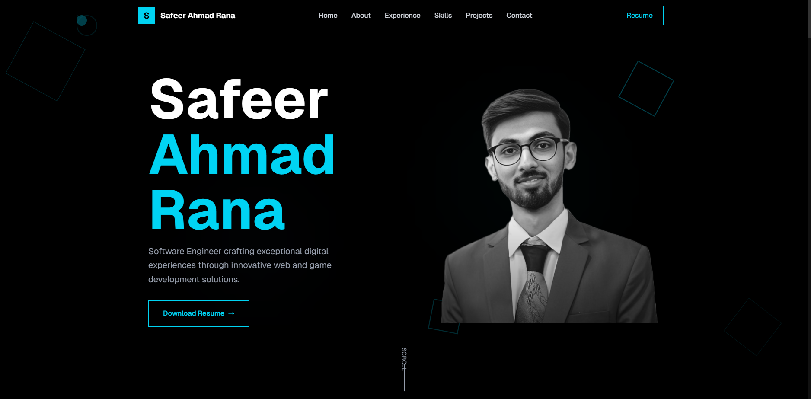
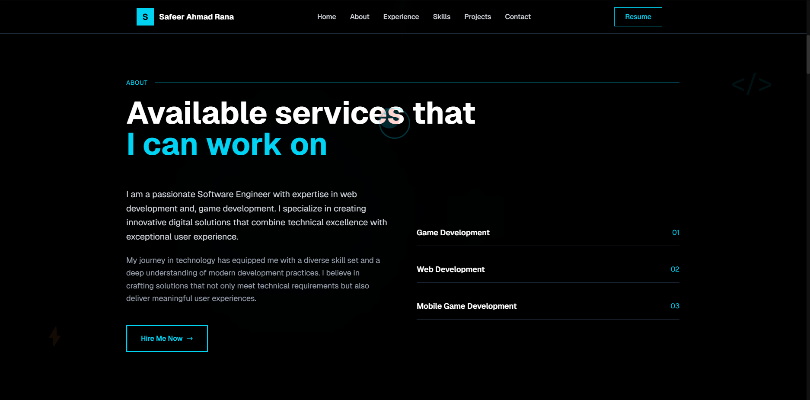
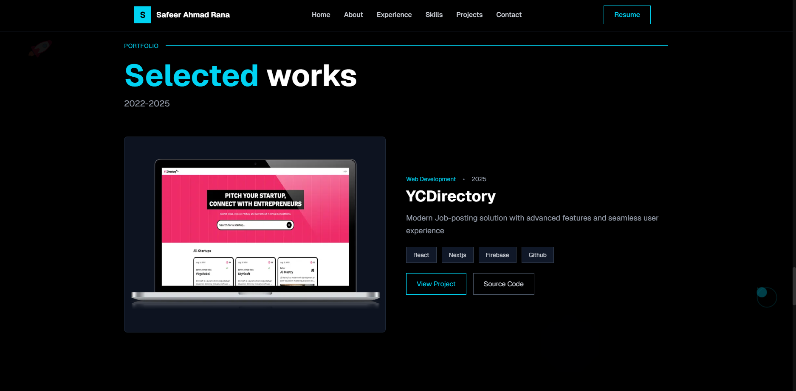

# Safeer Ahmad Rana — Portfolio

[](https://safeer-ahmad-rana.vercel.app)

Welcome to my personal portfolio website, built with [Next.js](https://nextjs.org/) and [Tailwind CSS](https://tailwindcss.com/).  
Showcasing my work in Game Development, Web Development, and UI/UX Design.

🌐 **Live Project:** [safeer-ahmad-rana.vercel.app](https://safeer-ahmad-rana.vercel.app)

---

## 🚀 Features

- Responsive design for all devices
- Animated backgrounds and interactive UI
- Sections for About, Education, Experience, Projects, and Contact
- Downloadable resume
- Modern stack: Next.js, React, Tailwind CSS, Framer Motion

---

## 📸 Preview





---

## 🛠️ Getting Started

Clone the repository and install dependencies:

```bash
git clone https://github.com/yourusername/portfolio.git
cd portfolio
npm install
```

Run the development server:

```bash
npm run dev
```

Open [http://localhost:3000](http://localhost:3000) to view it in your browser.

---

## 📁 Project Structure

- `components/` — React components for each section
- `public/` — Static assets and images
- `styles/` — Global styles
- `app/` — Next.js app directory

---

## 📄 License

This project is open source and available under the [MIT License](LICENSE).

---

## 🙋‍♂️ Contact

Feel free to connect with me:

- [LinkedIn](https://www.linkedin.com/in/safeer-ahmad-rana/)
- [GitHub](https://github.com/safeer-ahmad-rana)
- [Portfolio](https://safeer-ahmad-rana.vercel.app)

---

> © 2025 Safeer Ahmad Rana. All rights reserved.

```
**Note:**  
- Place your screenshots in the `public/` folder as `portfolio-preview.png`, `portfolio-home.png`, `portfolio-about.png`, and `portfolio-projects.png` or update the image paths as needed.
- Update the GitHub repo link if you
